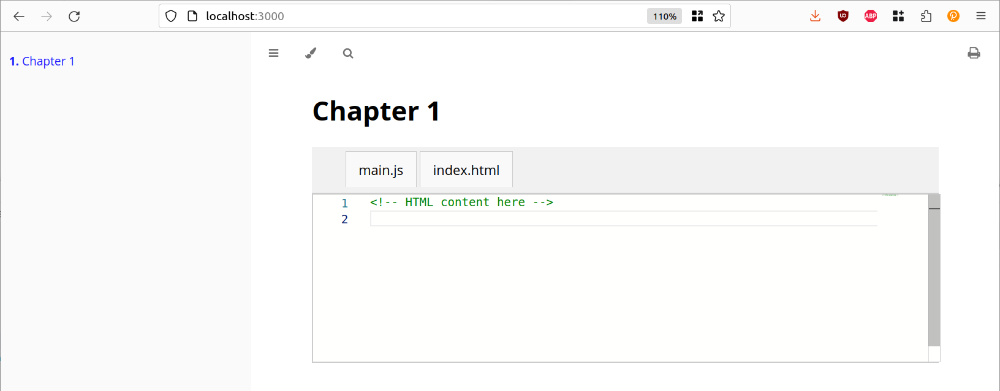

# mdbook-monaco
Multi-file editing for mdBook. 

# How it works

Custom pre-processor (or Plugin) for mdBook to support multi-file editors. 

Using this will create a pane where you can edit files. The file contents are stored in localStorage. 

````
```monaco
id: editor1_chapter1
files:
  - name: "main.js"
    language: javascript
    editable: false
    content: |
      // JavaScript code here
  - name: "index.html"
    language: html
    content: |
      <!-- HTML content here -->
actions:
  - name: "run"
    function: runCode
  - name: "build"
    function: buildProject
```
````

will generate the following:



You can adapt the functionality by providing the implementations for runCode & buildProject yourself. 

# Get started

```
cargo install --git https://github.com/KarimJedda/mdbook-monaco
```

Then let `mdbook-monaco` add the required files and configuration:

```
mdbook-monaco install path/to/your/book
```

Then, create a theme/head.hbs file with following content:

```html
<script type="module"> 
    import * as monaco from 'https://cdn.jsdelivr.net/npm/monaco-editor@0.44.0/+esm'
    window.monaco = monaco;
</script>
```

# TODOS

- [ ] Tidy up Rust code (but keep it legible, plz)
- [ ] Make the panes & editor prettier
- [ ] Add actions & buttons
- [ ] Test it a bit more (especially regressions)
- [ ] Load CSS & Javascript only on required pages, not all of them
- [ ] Automate the integration of the `head.hbs` file (one step less)
- [ ] ???

Then, create a theme/head.hbs file with following content:

```html
<script type="module"> 
    import * as monaco from 'https://cdn.jsdelivr.net/npm/monaco-editor@0.44.0/+esm'
    window.monaco = monaco;
</script>
```

# TODOS

- [ ] Make it prettier
- [ ] Test it a bit more (especially regressions)
- [ ] Load CSS & Javascript only on required pages, not all of them
- [ ] Automate the integration of the `head.hbs` file (one step less)
- [ ] ???


# License

MPL. See LICENSE.

Copyright (c) 2023 Karim Jedda karim.jedda@gmail.com

# Credits

The codebase is largely inspired from the [mdbook-mermaid](https://github.com/badboy/mdbook-mermaid/tree/main) repository by Jan-Erik Rediger. 
